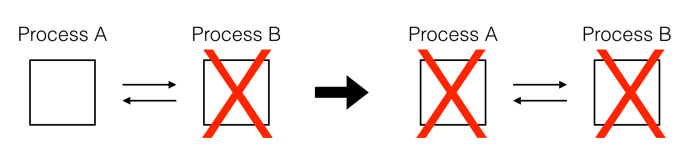
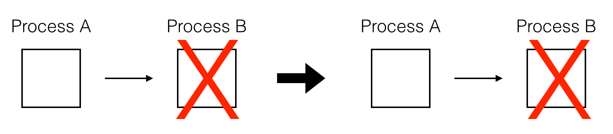
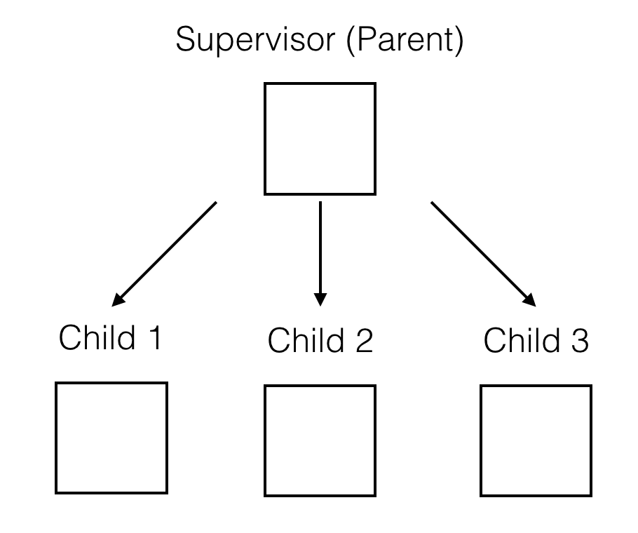
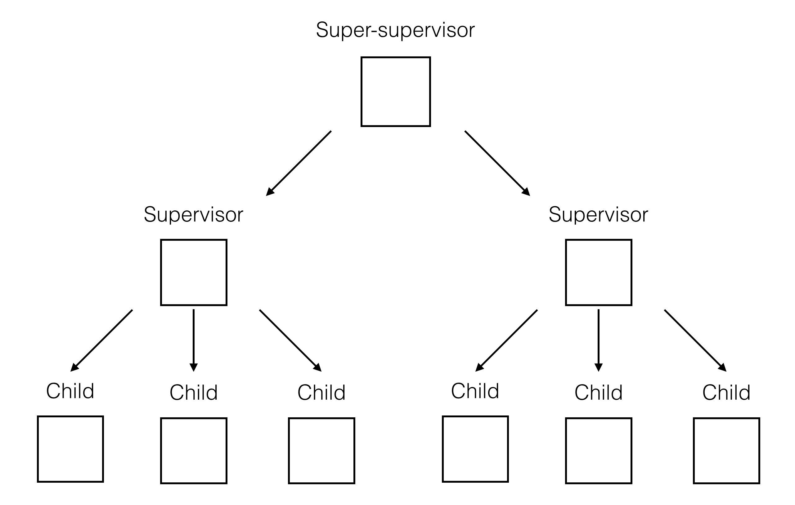
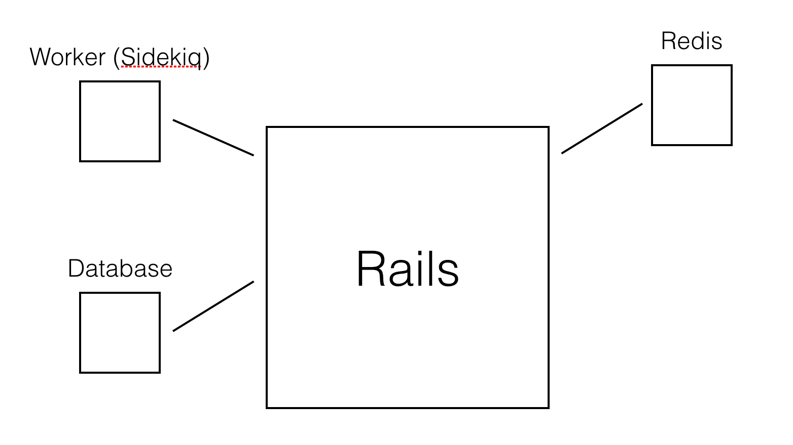
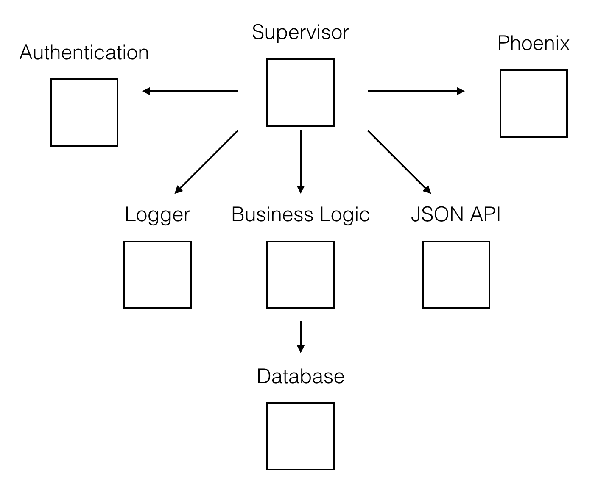

# An Intro to Elixir and OTP

## @johnmosesman

--- 

# Reasons for this talk

1. Understand in what areas Elixir shines and how to use it
2. Show you some genuinely cool technology

--- 

# Talk Structure

1. What is Elixir?
2. What kinds of problems does it solve?
3. How does it solve these problems?
4. How does using Elixir affect how we develop software systems?

---

# Side-note: We still love Ruby


---

# 1. What is Elixir?

---

# What is Elixir?

* Functional language created by José Valim
* Built on top of and compiles down to Erlang and runs on the Erlang VM, the BEAM.
* Concurrent by default
* Data is immutable

---

# What is OTP?

* Open Telecom Platform 
* Erlang code that describes how servers (nodes) communicate with each other
* Stable technology that has existed for decades

---

## 2. What kind of problems does it solve?

---

# Erlang use in the wild (stolen from SO)

* Amazon uses Erlang to implement SimpleDB, providing database services as a part of the Amazon Elastic Compute Cloud (EC2).
* Yahoo! uses it in its social bookmarking service, Delicious, which has more than 5 million users and 150 million bookmarked URLs.
* Facebook uses Erlang to power the backend of its chat service, handling more than 100 million active users. 
* WhatsApp uses Erlang to run messaging servers, achieving up to 2 million connected users per server.

---

# Erlang use in the wild (cont'd)
* T-Mobile uses Erlang in its SMS and authentication systems.
* Motorola is using Erlang in call processing products in the public-safety industry.
* Ericsson uses Erlang in its support nodes, used in GPRS and 3G mobile networks worldwide.
* The CouchDB “schema-less” document-oriented database, providing scalability across multicore and multiserver clusters.
* RabbitMQ, an AMQP messaging protocol implementation. AMQP is an emerging standard for high-performance enterprise messaging.

---

# What problems?

1. Performance and scaling issues
2. Multipart systems with pieces that communicate with each other
3. Continuously running systems or systems with a lot of background processing
4. Poor app architecture*

---

## 3. How does it solve these problems?

---

# How?

1. Incredible performance
2. Fault tolerance
3. Separation of concerns

---

# But how, technically?

---

# Processes

---

# Processes 

These are not OS-level processes.

Instead they are:

* Lightweight
* Isolated
* Concurrent

---

# Spawning a process

```
iex> pid = spawn fn -> IO.puts(1 + 1) end
2
#PID<0.141.0>
```

---

# Spawning a process

```
iex> pid = spawn fn -> IO.puts(1 + 1) end
2
#PID<0.141.0>
iex> Process.alive?(pid)
false
```

---

# Communicating with a process

* Every process has a "mailbox" system.
* To communicate with a process you send a message to its mailbox.
* The process reads the message and if it knows how to handle that type of message, it does some work.

---

# Communicating with a process

* IEx ("rails console") is itself a process

```
iex> self()
#PID<0.41.0>
iex> Process.alive?(self())
true
```

---

# Communicating with a process

* Use `send` and `receive` to interact with the mailbox.

```
iex> send self(), {:hello, "world"}
{:hello, "world"}
```

---

# Communicating with a process

* Use `send` and `receive` to interact with the mailbox.

```
iex> send self(), {:hello, "world"}
{:hello, "world"}
iex> receive do
...>   {:hello, msg} -> msg
...>   {:world, msg} -> "won't match"
...> end
"world"
```

---

# A continually running process

```
$ mix new okcrb
$ cd okcrb
$ iex -S mix
```

(`mix` is similar to the `rails` or `rake` commands)

---

# A continually running process

```
# lib/okcrb.ex
defmodule Okcrb do
  def start do
    spawn fn -> loop end
  end

  defp loop do
    receive do
      {:hello, msg} -> IO.puts(msg)
      {:world, _} -> IO.puts("no message for you")
    end
    loop
  end
end
```

---

# Testing our process

```
iex> pid = Okcrb.start
#PID<0.119.0>
iex> send pid, {:hello, "okcrb"}
okcrb
{:hello, "okcrb"}
iex> send pid, {:world, "okcrb"}
no message for you
{:world, "okcrb"}
```

---

# Enter OTP

```
defmodule Okcrb do
  def start do
    spawn fn -> loop end
  end

  defp loop do
    receive do
      {:hello, msg} -> IO.puts(msg)
      {:world, _} -> IO.puts("no message for you")
    end
    loop
  end
end
```

---

# OTP abstractions

* Task (one-off tasks)
* Agent (state storage)
* GenServer (generic client/server)
* ETS (Erlang's built in Redis)
* GenStage (consumer/producer processes)

---

# GenServer

## (Generic Server)

---

# Goal of a GenServer

> "The goal of a GenServer is to abstract the “receive” loop for developers, automatically handling system messages, support code change, synchronous calls and more."
>
> -- Hex Docs (https://hexdocs.pm/elixir/GenServer.html)

---

# Creating a GenServer

```
defmodule TweetFetcher do
  use GenServer

  # Client functions (your public API - sending the messages) 

  # Server callbacks (handling the messages)
end
```

---

# Creating a GenServer

```
defmodule TweetFetcher do
  use GenServer

  def fetch_tweets(pid) do
    # Send a "fetch_tweets" message to the server with PID of `pid`
  end

  # Server callbacks (handling the messages)
end
```

---

# Types of messages

* `call` - synchronous, wait for a response
* `cast` - asynchronous, don't wait for a response

---

# Sending a message to our GenServer

```
defmodule TweetFetcher do
  use GenServer

  def fetch_tweets(pid, user_id) 
    GenServer.call(pid, {:fetch_tweets, user_id})    
    # or GenServer.cast(pid, {:fetch_tweets, user_id})
  end
  
  # Server callbacks
end
```

---

# Receiving the message

* `handle_call(request, from, state)`
* `handle_cast(request, state)`

---

# `handle_call`

* `{:reply, reply, new_state}`
* `{:noreply, new_state}`
* `{:stop, reason, reply, new_state}` 

---

# `handle_cast`

* `{:noreply, new_state}`
* `{:stop, reason, new_state}`

---

# `handle_info`

* Called by system processes
* Notifies of things like a process being down

Returns:

* `{:noreply, new_state}`
* `{:stop, reason, new_state}`

---

# Putting it all together

```
defmodule TweetFetcher do
  use GenServer

  def fetch_tweets(pid) do
    GenServer.cast(pid, :fetch_tweets)
  end
  
  def tweets(pid) do
    GenServer.call(pid, :tweets)
  end
  
  ...
```
  
---

# Putting it all together

```
defmodule TweetFetcher do
  ...

  def handle_cast(:fetch_tweets, state) do
    {:noreply, ["new tweet" | state]}
  end

  def handle_call(:tweets, _from, state) do
    {:reply, state, state}
  end
end
```

---

# Putting it all together

```
iex(1)> {:ok, pid} = GenServer.start_link(TweetFetcher, [])
{:ok, #PID<0.119.0>}
```

---

# Putting it all together

```
iex(1)> {:ok, pid} = GenServer.start_link(TweetFetcher, [])
{:ok, #PID<0.119.0>}
iex(2)> TweetFetcher.fetch_tweets(pid)
:ok
```

---

# Putting it all together

```
iex(1)> {:ok, pid} = GenServer.start_link(TweetFetcher, [])
{:ok, #PID<0.119.0>}
iex(2)> TweetFetcher.fetch_tweets(pid)
:ok
iex(3)> TweetFetcher.tweets(pid)
["new tweet"]
```

---

# Putting it all together

```
iex(1)> {:ok, pid} = GenServer.start_link(TweetFetcher, [])
{:ok, #PID<0.119.0>}
iex(2)> TweetFetcher.fetch_tweets(pid)
:ok
iex(3)> TweetFetcher.tweets(pid)
["new tweet"]
iex(4)> TweetFetcher.fetch_tweets(pid)
:ok
```

---

# Putting it all together

```
iex(1)> {:ok, pid} = GenServer.start_link(TweetFetcher, [])
{:ok, #PID<0.119.0>}
iex(2)> TweetFetcher.fetch_tweets(pid)
:ok
iex(3)> TweetFetcher.tweets(pid)
["new tweet"]
iex(4)> TweetFetcher.fetch_tweets(pid)
:ok
iex(5)> TweetFetcher.tweets(pid)
["new tweet", "new tweet"]
```

---

# We know how, so what is the result?

---

# Performance

> "Today we have tuned some knobs, shifted some traffic around and achieved 1 million established tcp sessions on a single machine (and with memory and cpu to spare!)"
>
> -- WhatsApp Blog (blog.whatsapp.com/170/ONE-MILLION%21)

---

# Performance

```
[info] GET /
[info] Sent 200 in 389µs
```


---

# Performance

Turns out compiled, concurrent languages are fast.

---

# Fault tolerance

---

# Fault tolerance

* Distributed systems come at cost
* Increased complexity means more potential for problems

---

# How does Elixir handle errors?

* The Elixir Way: "Let it crash."
* Exceptional circumstances should be exceptional

---

# Let it crash


### Note: doesn't save you from yourself.

---

# How do you interact with crashes? 
## -> Links and monitors

---

# Links

* Links two processes together (bidirectional).
* If a process crashes, all linked processes crash as well.
* Links **emit signals between processes**



---

# Monitors

* Monitors a process (unidirectional).
* A crash in the monitored process doesn't affect the monitoring process
* Instead of signals Monitors **receive a message in their mailbox.**



---

# Supervisors

---

# Supervisors

* Forms a link to another process (parent-child relationship)
* Traps exits so they can perform a "supervision strategy"



---

# Supervisors

This forms "Supervision Trees"



---

# Supervisor 

```
defmodule OkcrbPhoenix do
  use Application

  def start(_type, _args) do
    import Supervisor.Spec

    children = [
      supervisor(OkcrbPhoenix.Repo, []),
      supervisor(OkcrbPhoenix.Endpoint, []),
    ]

    opts = [strategy: :one_for_one, name: OkcrbPhoenix.Supervisor]
    Supervisor.start_link(children, opts)
  end

  ...
end
```

---

# (Erlang observer)

## `iex> :observer.start`

---

# 4. How does using Elixir affect how we develop software systems?

---

# "A majestic monolith" - DHH 2016



---

# Elixir apps are made up of...microservices.

---

# Elixir app



---


#### http://tech.noredink.com/post/142689001488/the-most-object-oriented-language

---

# Conclusion

* Elixir is the sum of a few very good parts.
* Developer happiness / productivity from things like Ruby
* All of the power and reliability of Erlang/OTP
* Strong system architecture practices
* There's cool stuff popping up around Elixir

---

# Resources

* Elixir docs - http://elixir-lang.org/
* Hex docs - https://hexdocs.pm/elixir/GenServer.html
* Elixir school - https://elixirschool.com/

---

# Resources

Elixir In Action

https://www.manning.com/books/elixir-in-action


---

# OKC Elixir

## Tuesday, May 30 @ 8:00pm Central

### https://elixir.school/t/may-30-testing/135

---

# Questions?

---

# Thanks!

---