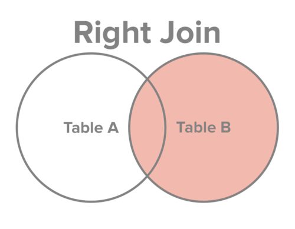

# SQL, the Database, and You

---

# John Mosesman
## Developer, consultant, database-liker

---

 
 


---

# Why this talk?

- Your app is your data
- Databases are one of the first and almost universal dependencies
- Databases can be one of the first performance bottlenecks
- Data storage and querying is not very intuitive
- Useful knowledge for all types of devs

---

# Talk structure

1. Structuring data for a relational database
2. Querying (SQL)
3. Associations
4. Data integrity
5. Performance

---

# 1. Structuring data for a relational database

---


---

 
 

--- 

## Databases

_tables, rows, columns_

```
+-------+-----------+------+--------+
| food  | tastiness | cost | health |
+-------+-----------+------+--------+
| sushi |        10 |   10 |      7 |
| pizza |         8 |    5 |      3 |
| salad |         2 |    8 |      9 |
| water |         0 |    0 |     10 |
+-------+-----------+------+--------+
```

---

## What is "good" structure?

- Goal: to reduce data redundancy and improve data integrity
- Free from change anomalies

---

### FEATURE REQUEST
## "People and their pets"

---

## "People and their pets"

```
+-------------+------------+--------------+--------------+----------+----------+----------+
| person_name | person_age |  work_place  |  work_phone  | pet_name | pet_type | pet_legs |
+-------------+------------+--------------+--------------+----------+----------+----------+
| John        |         26 | Pizza Palace | 555-555-5555 | Ruby     | Dog      |        4 |
| Susan       |         22 | Pizza Hut    | 111-111-1111 | Pete     | Bird     |        2 |
| Jim         |         30 | Pizza Town   | 333-333-3333 | Fluffy   | Cat      |        4 |
+-------------+------------+--------------+--------------+----------+----------+----------+
```

---

## Adding a pet

```
+-------------+------------+--------------+--------------+----------+----------+----------+
| person_name | person_age |  work_place  |  work_phone  | pet_name | pet_type | pet_legs |
+-------------+------------+--------------+--------------+----------+----------+----------+
| John        |         26 | Pizza Palace | 555-555-5555 | Ruby     | Dog      |        4 |
| Susan       |         22 | Pizza Hut    | 111-111-1111 | Pete     | Bird     |        2 |
| Jim         |         30 | Pizza Town   | 333-333-3333 | Fluffy   | Cat      |        4 |
| John        |         26 | Pizza Palace | 555-555-5555 | Buddy    | Dog      |        4 |
+-------------+------------+--------------+--------------+----------+----------+----------+
```

---

## Adding a pet

```
+-------------+------------+--------------+--------------+-----------+-----------+-----------+-----------+-----------+-----------+
| person_name | person_age |  work_place  |  work_phone  | pet1_name | pet1_type | pet1_legs | pet2_name | pet2_type | pet2_legs |
+-------------+------------+--------------+--------------+-----------+-----------+-----------+-----------+-----------+-----------+
| John        |         26 | Pizza Palace | 555-555-5555 | Ruby      | Dog       |         4 | Buddy     | Dog       |         4 |
| Susan       |         22 | Pizza Hut    | 111-111-1111 | Pete      | Bird      |         2 |           |           |           |
| Jim         |         30 | Pizza Town   | 333-333-3333 | Fluffy    | Cat       |         4 |           |           |           |
+-------------+------------+--------------+--------------+-----------+-----------+-----------+-----------+-----------+-----------+
```

---

## Owner gives up a pet

```
+-------------+------------+--------------+--------------+----------+----------+----------+
| person_name | person_age |  work_place  |  work_phone  | pet_name | pet_type | pet_legs |
+-------------+------------+--------------+--------------+----------+----------+----------+
| John        |         26 | Pizza Palace | 555-555-5555 | Ruby     | Dog      |        4 |
| ???         |         ?? | Pizza Hut    | 111-111-1111 | Pete     | Bird     |        2 |
| Jim         |         30 | Pizza Town   | 333-333-3333 | Fluffy   | Cat      |        4 |
+-------------+------------+--------------+--------------+----------+----------+----------+
```

---

## Database "Normalization"

---

## The Three "Normal Forms"

- Introduced by Dr. Edgar F. Codd
- Meets our goal of "reduce data redundancy and improve data integrity"

---

## 1st Normal Form

"The information is stored in a relational table and each column contains atomic values, and there are not repeating groups of columns."[^1]

```
+-------------+------------+-----------+-----------+-----------+-----------+-----------+-----------+
| person_name | person_age | pet1_name | pet1_type | pet1_legs | pet2_name | pet2_type | pet2_legs |
+-------------+------------+-----------+-----------+-----------+-----------+-----------+-----------+
| John        |         26 | Ruby      | Dog       |         4 | Buddy     | Dog       |         4 |
| Susan       |         22 | Pete      | Bird      |         2 |           |           |           |
| Jim         |         30 | Fluffy    | Cat       |         4 |           |           |           |
+-------------+------------+-----------+-----------+-----------+-----------+-----------+-----------+
```

[^1]: https://www.essentialsql.com/get-ready-to-learn-sql-database-normalization-explained-in-simple-english/

---

## 1st Normal Form

```
people
+-------------+------------+--------------+--------------+
| person_name | person_age |  work_place  |  work_phone  |
+-------------+------------+--------------+--------------+
| John        |         26 | Pizza Palace | 555-555-5555 |
| Susan       |         22 | Pizza Hut    | 111-111-1111 |
| Jim         |         30 | Pizza Town   | 333-333-3333 |
+-------------+------------+--------------+--------------+

pets
+-------------+----------+----------+----------+
| person_name | pet_name | pet_type | pet_legs |
+-------------+----------+----------+----------+
| John        | Ruby     | Dog      |        4 |
| Susan       | Pete     | Bird     |        2 |
| Jim         | Fluffy   | Cat      |        4 |
+-------------+----------+----------+----------+
```

---

## 2nd Normal Form

"The table is in first normal form and all the columns depend on the table’s primary key."[^1]

```
people
+-------------+------------+--------------+--------------+
| person_name | person_age |  work_place  |  work_phone  |
+-------------+------------+--------------+--------------+
| John        |         26 | Pizza Palace | 555-555-5555 |
| Susan       |         22 | Pizza Hut    | 111-111-1111 |
| Jim         |         30 | Pizza Town   | 333-333-3333 |
+-------------+------------+--------------+--------------+
```

---

## 2nd Normal Form

```
people
+-------------+------------+
| person_name | person_age |
+-------------+------------+
| John        |         26 |
| Susan       |         22 |
| Jim         |         30 |
+-------------+------------+

work_places
+-------------+--------------+--------------+
| person_name |  work_place  |  work_phone  |
+-------------+--------------+--------------+
| John        | Pizza Palace | 555-555-5555 |
| Susan       | Pizza Hut    | 111-111-1111 |
| Jim         | Pizza Town   | 333-333-3333 |
+-------------+--------------+--------------+
```

---

## 3rd Normal Form

"The table is in second normal form and all of its columns are not transitively dependent on the primary key."[^1]

_Or_

"Every non-key attribute must provide a fact about the key, the whole key, and nothing but the key, so help me Codd."[^2]

[^2]: Credited to Bill Kent on Wikipedia

---

## 3rd Normal Form

```
pets
+-------------+----------+----------+----------+
| person_name | pet_name | pet_type | pet_legs |
+-------------+----------+----------+----------+
| John        | Ruby     | Dog      |        4 |
| Susan       | Pete     | Bird     |        2 |
| Jim         | Fluffy   | Cat      |        4 |
| John        | Buddy    | Dog      |        4 |
+-------------+----------+----------+----------+
```

---

## 3rd Normal Form

```
pets
+-------------+----------+----------+
| person_name | pet_name | pet_type |
+-------------+----------+----------+
| John        | Ruby     | Dog      |
| Susan       | Pete     | Bird     |
| Jim         | Fluffy   | Cat      |
| John        | Buddy    | Dog      |
+-------------+----------+----------+

pet_types
+----------+----------+
| pet_type | pet_legs |
+----------+----------+
| Dog      |        4 |
| Bird     |        2 |
| Cat      |        4 |
+----------+----------+
```

---

## Almost There

```
people
+-------------+------------+
| person_name | person_age |
+-------------+------------+
| John        |         26 |
| Susan       |         22 |
| Jim         |         30 |
+-------------+------------+

pets
+-------------+----------+----------+
| person_name | pet_name | pet_type |
+-------------+----------+----------+
| John        | Ruby     | Dog      |
| Susan       | Pete     | Bird     |
| Jim         | Fluffy   | Cat      |
| John        | Buddy    | Dog      |
+-------------+----------+----------+
```

---

## IDs and Primary Keys

_Primary key_ - one or more columns that uniquely identifies each row

```
people
+----+-------------+------------+
| id | person_name | person_age |
+----+-------------+------------+
|  1 | John        |         26 |
|  2 | Susan       |         22 |
|  3 | Jim         |         30 |
+----+-------------+------------+

pets
+----+-----------+----------+----------+
| id | person_id | pet_name | pet_type |
+----+-----------+----------+----------+
| 20 |         1 | Ruby     | Dog      |
| 21 |         2 | Pete     | Bird     |
| 22 |         3 | Fluffy   | Cat      |
| 23 |         1 | Buddy    | Dog      |
+----+-----------+----------+----------+
```

---

## Foreign Keys

_Foreign key_ - a reference to a primary key in another table

```
people
+------------------+-------------+------------+
| id (PK)          | person_name | person_age |
+------------------+-------------+------------+
|                1 | John        |         26 |
|                2 | Susan       |         22 |
|                3 | Jim         |         30 |
+------------------+-------------+------------+

pets
+------------------+-------------------------+----------+----------+
| id (PK)          | person_id (FK)          | pet_name | pet_type |
+------------------+-------------------------+----------+----------+
|               20 |                       1 | Ruby     | Dog      |
|               21 |                       2 | Pete     | Bird     |
|               22 |                       3 | Fluffy   | Cat      |
|               23 |                       1 | Buddy    | Dog      |
+------------------+-------------------------+----------+----------+
```

---

# 2. Querying

---

## Structured Query Language (SQL)

Most modern Database Management Systems (DBMS) adhere to the SQL Standard.

---

## Creating a table

```
CREATE TABLE people (
  first_name VARCHAR,
  last_name  VARCHAR,
  age        INTEGER
)

---

CREATE TABLE
```

---

## Data types

- `CHAR/VARCHAR/TEXT`
- `INTEGER`
- `BOOLEAN`
- `DATE/DATETIME`

---

## SELECT

```
SELECT *
FROM people

---

0 rows
```

(_*_ = all columns)

---

## SELECT

```
SELECT first_name, last_name
FROM people

---

0 rows
```

---

## INSERT

```
INSERT INTO people (first_name, last_name, age) VALUES
  ('John', 'Mosesman', 26),
  ('Bob', 'Smith', 40),
  ('Jane', 'Doe', 32)
  
---

INSERT 0 3
```

---

## WHERE

```
SELECT *
FROM people
WHERE first_name = 'John'

---

+------------+-----------+-----+
| first_name | last_name | age |
+------------+-----------+-----+
| John       | Mosesman  |  26 |
+------------+-----------+-----+
```

---

## WHERE

```
INSERT INTO people
SELECT 'John', 'Smith', 100

---

SELECT *
FROM people
WHERE first_name = 'John'

---

+------------+-----------+-----+
| first_name | last_name | age |
+------------+-----------+-----+
| John       | Mosesman  |  26 |
| John       | Smith     | 100 |
+------------+-----------+-----+
```

---

## AND and OR

```
SELECT *
FROM people
WHERE first_name = 'John'
  AND last_name = 'Mosesman'

---

SELECT *
FROM people
WHERE age > 50
  OR age < 20
```

---

## ALTER

```
ALTER TABLE people ADD COLUMN id SERIAL PRIMARY KEY;

---

SELECT *
FROM people
WHERE id = 1

---

+----+------------+-----------+-----+
| id | first_name | last_name | age |
+----+------------+-----------+-----+
|  1 | John       | Mosesman  |  26 |
+----+------------+-----------+-----+
```

---

## UPDATE

```
UPDATE people
SET first_name = 'Jack'
WHERE id = 2

---

UPDATE 1
```

---

## Aggregations

```
SELECT AVG(age) FROM people     -- 49.5

SELECT SUM(age) FROM people     -- 198

SELECT COUNT(*) FROM people     -- 4
```

---

# 3. Associations

---

## Our Pet Store

```
people
+----+-------------+------------+
| id | name        | age        |
+----+-------------+------------+
|  1 | John        |         26 |
|  2 | Susan       |         22 |
|  3 | Jim         |         30 |
+----+-------------+------------+

pets
+----+-----------+--------+------+-----+
| id | person_id |  name  | type | age |
+----+-----------+--------+------+-----+
| 20 |         1 | Ruby   | Dog  |   3 |
| 21 |         2 | Pete   | Bird |   5 |
| 22 |         3 | Fluffy | Cat  |  12 |
| 23 |         1 | Buddy  | Dog  |   1 |
+----+-----------+--------+------+-----+
```

---

## Our Pet Store (in SQL)

```
CREATE TABLE people (
  id SERIAL PRIMARY KEY,
  name VARCHAR,
  age INTEGER
)
```

---

## Our Pet Store (in SQL)

```
CREATE TABLE people (
  id SERIAL PRIMARY KEY,
  name VARCHAR,
  age INTEGER
)

CREATE TABLE pets (
  id SERIAL PRIMARY KEY,
  person_id INTEGER REFERENCES people,
  name VARCHAR,
  age INTEGER
)
```

---

### FEATURE REQUEST

## "Find all of a person's pets"

---

## Finding pets

```
SELECT *
FROM pets
WHERE person_id = 1

---

+----+-----------+-------+-----+
| id | person_id | name  | age |
+----+-----------+-------+-----+
|  1 |         1 | Ruby  |   1 |
|  4 |         1 | Buddy |   3 |
+----+-----------+-------+-----+
```

---

### FEATURE REQUEST

## "Get everyone and their pets"

---

## JOINs

"Join" two tables together by matching related rows.

```
+-----------+-------------+------------+---------+----------------+-----------+----------+
| people.id | people.name | people.age | pets.id | pets.person_id | pets.name | pets.age |
+-----------+-------------+------------+---------+----------------+-----------+----------+
|         1 | John        |         26 |      20 |              1 | Ruby      |        3 |
|       ... |             |            |         |                |           |          |
+-----------+-------------+------------+---------+----------------+-----------+----------+
```

---

## Naive JOIN implementation

1. Combine every row from `people` with every row from `pets`
2. Filter out rows that don't match

---

## Cartesian Product or "Cross Join"

```
+--------+
| letter |
+--------+
| A      |
| B      |
+--------+

+--------+
| number |
+--------+
|      1 |
|      2 |
+--------+
```

---

## Cartesian Product or "Cross Join"

```
+--------+--------+
| letter | number |
+--------+--------+
| A      |      1 |
| A      |      2 |
| B      |      1 |
| B      |      2 |
+--------+--------+
```

---

## CROSS JOIN of `people` and `pets`

```
SELECT *
FROM people
  CROSS JOIN pets

---

16 rows

+----+---------------+-----+----+-----------+--------+-----+
| id |     name      | age | id | person_id |  name  | age |
+----+---------------+-----+----+-----------+--------+-----+
|  1 | John Mosesman |  26 |  1 |         1 | Ruby   |   1 |
|  1 | John Mosesman |  26 |  2 |         2 | Pete   |   5 |
|  1 | John Mosesman |  26 |  3 |         3 | Fluffy |  12 |
|  1 | John Mosesman |  26 |  4 |         1 | Buddy  |   3 |
|  2 | Bob Smith     |  40 |  1 |         1 | Ruby   |   1 |
|  2 | Bob Smith     |  40 |  2 |         2 | Pete   |   5 |
|  2 | Bob Smith     |  40 |  3 |         3 | Fluffy |  12 |
|  2 | Bob Smith     |  40 |  4 |         1 | Buddy  |   3 |
|  3 | Jane Doe      |  32 |  1 |         1 | Ruby   |   1 |
|  ...                                                     |
+----+---------------+-----+----+-----------+--------+-----+
```

---

## CROSS JOIN of `people` and `pets`

```
+----+---------------+-----+----+-----------+--------+-----+
| id |     name      | age | id | person_id |  name  | age |
+----+---------------+-----+----+-----------+--------+-----+
|  1 | John Mosesman |  26 |  1 |         1 | Ruby   |   1 |
|  1 | John Mosesman |  26 |  2 |   2 (???) | Pete   |   5 |
| ...                                                      |
+----+---------------+-----+----+-----------+--------+-----+
```

---

## CROSS JOIN with filter

```
SELECT *
FROM people
  CROSS JOIN pets
WHERE people.id = pets.person_id

---

4 rows

+----+---------------+-----+----+-----------+--------+-----+
| id |     name      | age | id | person_id |  name  | age |
+----+---------------+-----+----+-----------+--------+-----+
|  1 | John Mosesman |  26 |  1 |         1 | Ruby   |   1 |
|  2 | Bob Smith     |  40 |  2 |         2 | Pete   |   5 |
|  3 | Jane Doe      |  32 |  3 |         3 | Fluffy |  12 |
|  1 | John Mosesman |  26 |  4 |         1 | Buddy  |   3 |
+----+---------------+-----+----+-----------+--------+-----+
```

---

## JOIN

```
SELECT *
FROM people
  JOIN pets ON pets.person_id = people.id
```

---

## JOIN filtering

```
SELECT *
FROM people
  JOIN pets ON pets.person_id = people.id
    AND pets.age > 2

---

SELECT *
FROM people
  JOIN pets ON pets.person_id = people.id
    AND pets.age > 2
WHERE people.age < 30
```

---

## Order of Operations

1. FROM
2. JOIN
3. WHERE
4. SELECT

---

## Order of Operations

```
SELECT *
FROM people
  JOIN pets ON pets.person_id = people.id
    AND pets.age > 2
WHERE people.age < 30

---

SELECT *
FROM people
  JOIN pets ON pets.person_id = people.id
WHERE people.age < 30
  AND pets.age > 2
```

---

### FEATURE REQUEST

## "Track pet shot records."

---

## Multiple JOINs

```
CREATE TABLE shot_records (
  id SERIAL PRIMARY KEY,
  pet_id INTEGER REFERENCES pets,
  shot_name VARCHAR,
  date DATE 
);

---

INSERT INTO shot_records (pet_id, shot_name, date) VALUES
(1, 'Rabies', CURRENT_DATE),
(1, 'Bordetella', CURRENT_DATE)
```

---

## Multiple JOINs

```
SELECT *
FROM people
  JOIN pets ON pets.person_id = people.id
  JOIN shot_records sr ON sr.pet_id = pets.id
  
---

+----+---------------+-----+----+-----------+------+-----+----+--------+------------+------------+
| id |     name      | age | id | person_id | name | age | id | pet_id | shot_name  |    date    |
+----+---------------+-----+----+-----------+------+-----+----+--------+------------+------------+
|  1 | John Mosesman |  26 |  1 |         1 | Ruby |   1 |  1 |      1 | Rabies     | 2017-07-20 |
|  1 | John Mosesman |  26 |  1 |         1 | Ruby |   1 |  2 |      1 | Bordetella | 2017-07-20 |
+----+---------------+-----+----+-----------+------+-----+----+--------+------------+------------+
```

---

## Join Types

---

## CROSS JOIN (Union)[^4]


[^4]: http://www.sql-join.com/sql-join-types/

---

## INNER JOIN (Intersection)[^4]


---

## OUTER JOIN[^4]

 

---

## Join Types[^4]

 
 

---

## A brief detour: NULL

---

## NULL In Other Languages

```
irb(main):001:0> nil == nil
=> true
irb(main):002:0> nil == 1
=> false
```

---

## NULL - "An unknown value"

```
SELECT 1 = 1                
```

---

## NULL - "An unknown value"

```
SELECT 1 = 1                -- TRUE
```

---

## NULL - "An unknown value"

```
SELECT 1 = 1                -- TRUE
SELECT 1 <> 1               
```

---

## NULL - "An unknown value"

```
SELECT 1 = 1                -- TRUE
SELECT 1 <> 1               -- FALSE
```

---

## NULL - "An unknown value"

```
SELECT 1 = 1                -- TRUE
SELECT 1 <> 1               -- FALSE
SELECT 1 = NULL             
```

---

## NULL - "An unknown value"

```
SELECT 1 = 1                -- TRUE
SELECT 1 <> 1               -- FALSE
SELECT 1 = NULL             -- NULL
```

---

## NULL - "An unknown value"

```
SELECT 1 = 1                -- TRUE
SELECT 1 <> 1               -- FALSE
SELECT 1 = NULL             -- NULL
SELECT 0 = NULL         
```

---

## NULL - "An unknown value"

```
SELECT 1 = 1                -- TRUE
SELECT 1 <> 1               -- FALSE
SELECT 1 = NULL             -- NULL
SELECT 0 = NULL             -- NULL
```

---

## NULL - "An unknown value"

```
SELECT 1 = 1                -- TRUE
SELECT 1 <> 1               -- FALSE
SELECT 1 = NULL             -- NULL
SELECT 0 = NULL             -- NULL
SELECT '' = NULL
```

---

## NULL - "An unknown value"

```
SELECT 1 = 1                -- TRUE
SELECT 1 <> 1               -- FALSE
SELECT 1 = NULL             -- NULL
SELECT 0 = NULL             -- NULL
SELECT '' = NULL            -- NULL
```

---

## NULL - "An unknown value"

```
SELECT 1 = 1                -- TRUE
SELECT 1 <> 1               -- FALSE
SELECT 1 = NULL             -- NULL
SELECT 0 = NULL             -- NULL
SELECT '' = NULL            -- NULL
SELECT NULL = NULL          
```

---

## NULL - "An unknown value"

```
SELECT 1 = 1                -- TRUE
SELECT 1 <> 1               -- FALSE
SELECT 1 = NULL             -- NULL
SELECT 0 = NULL             -- NULL
SELECT '' = NULL            -- NULL
SELECT NULL = NULL          -- NULL
```

---

## IS NULL / IS NOT NULL

```
SELECT 1 IS NULL            
```

---

## IS NULL / IS NOT NULL

```
SELECT 1 IS NULL            -- FALSE
```

---

## IS NULL / IS NOT NULL

```
SELECT 1 IS NULL            -- FALSE
SELECT 'pizza' IS NOT NULL  
```

---

## IS NULL / IS NOT NULL

```
SELECT 1 IS NULL            -- FALSE
SELECT 'pizza' IS NOT NULL  -- TRUE
```

---

## IS NULL / IS NOT NULL

```
SELECT 1 IS NULL            -- FALSE
SELECT 'pizza' IS NOT NULL  -- TRUE
SELECT NULL IS NULL         
```

---

## IS NULL / IS NOT NULL

```
SELECT 1 IS NULL            -- FALSE
SELECT 'pizza' IS NOT NULL  -- TRUE
SELECT NULL IS NULL         -- TRUE
```

---

## IS NULL / IS NOT NULL

```
SELECT 1 IS NULL            -- FALSE
SELECT 'pizza' IS NOT NULL  -- TRUE
SELECT NULL IS NULL         -- TRUE
SELECT NULL IS NOT NULL     
```

---

## IS NULL / IS NOT NULL

```
SELECT 1 IS NULL            -- FALSE
SELECT 'pizza' IS NOT NULL  -- TRUE
SELECT NULL IS NULL         -- TRUE
SELECT NULL IS NOT NULL     -- FALSE
```

---

## Back to JOINs

---

### FEATURE REQUEST

## "All people in our database, and their pet data—if they have any."

---

## OUTER JOIN (LEFT or RIGHT)

`people LEFT JOIN pets` => All people data, and pets if they have them

`people RIGHT JOIN pets` => All pets data, and people data if they have an owner

---

## people LEFT JOIN pets

```
SELECT *
FROM people
  LEFT JOIN pets ON pets.person_id = people.id
  
---

+----+---------------+-----+----+-----------+--------+-----+
| id |     name      | age | id | person_id |  name  | age |
+----+---------------+-----+----+-----------+--------+-----+
|  1 | John Mosesman |  26 |  1 |         1 | Ruby   |   1 |
|  2 | Bob Smith     |  40 |  2 |         2 | Pete   |   5 |
|  3 | Jane Doe      |  32 |  3 |         3 | Fluffy |  12 |
|  1 | John Mosesman |  26 |  4 |         1 | Buddy  |   3 |
|  4 | Jack Smith    | 100 |    |           |        |     |
+----+---------------+-----+----+-----------+--------+-----+
```

---

## people LEFT JOIN pets

```
SELECT *
FROM people
  LEFT JOIN pets ON pets.person_id = people.id
  
---

+----+---------------+-----+------+-----------+--------+------+
| id |     name      | age |  id  | person_id |  name  | age  |
+----+---------------+-----+------+-----------+--------+------+
|  1 | John Mosesman |  26 | 1    | 1         | Ruby   | 1    |
|  2 | Bob Smith     |  40 | 2    | 2         | Pete   | 5    |
|  3 | Jane Doe      |  32 | 3    | 3         | Fluffy | 12   |
|  1 | John Mosesman |  26 | 4    | 1         | Buddy  | 3    |
|  4 | Jack Smith    | 100 | NULL | NULL      | NULL   | NULL |
+----+---------------+-----+------+-----------+--------+------+
```

---

## People without pets

```
SELECT *
FROM people
  LEFT JOIN pets ON pets.person_id = people.id
WHERE pets.id IS NULL

---

+----+------------+-----+----+-----------+------+-----+
| id |    name    | age | id | person_id | name | age |
+----+------------+-----+----+-----------+------+-----+
|  4 | Jack Smith | 100 |    |           |      |     |
+----+------------+-----+----+-----------+------+-----+
```

---

### FEATURE REQUEST

## "People with pets that don't have their shots."

---

## Pets Without Shots

```
SELECT *
FROM people
  JOIN pets ON pets.person_id = people.id
  LEFT JOIN shot_records sr ON sr.pet_id = pets.id
WHERE sr.id IS NULL

---

+----+---------------+-----+----+-----------+--------+-----+----+--------+-----------+------+
| id |     name      | age | id | person_id |  name  | age | id | pet_id | shot_name | date |
+----+---------------+-----+----+-----------+--------+-----+----+--------+-----------+------+
|  2 | Bob Smith     |  40 |  2 |         2 | Pete   |   5 |    |        |           |      |
|  1 | John Mosesman |  26 |  4 |         1 | Buddy  |   3 |    |        |           |      |
|  3 | Jane Doe      |  32 |  3 |         3 | Fluffy |  12 |    |        |           |      |
+----+---------------+-----+----+-----------+--------+-----+----+--------+-----------+------+
```

---

## Pets Without Shots

```
SELECT people.*, pets.*
FROM people
  JOIN pets ON pets.person_id = people.id
  LEFT JOIN shot_records sr ON sr.pet_id = pets.id
WHERE sr.id IS NULL

---

+----+---------------+-----+----+-----------+--------+-----+
| id |     name      | age | id | person_id |  name  | age |
+----+---------------+-----+----+-----------+--------+-----+
|  2 | Bob Smith     |  40 |  2 |         2 | Pete   |   5 |
|  1 | John Mosesman |  26 |  4 |         1 | Buddy  |   3 |
|  3 | Jane Doe      |  32 |  3 |         3 | Fluffy |  12 |
+----+---------------+-----+----+-----------+--------+-----+
```

---

### FEATURE REQUEST

## "Find each person and the number of pets they have."

---

## Basic aggregations

```
SELECT AVG(age) FROM people

SELECT SUM(age) FROM people

SELECT COUNT(*) FROM people
```

---

## Group by person

```
SELECT *
FROM people
  JOIN pets ON pets.person_id = people.id
```

---

## Group by person

```
SELECT *
FROM people
  JOIN pets ON pets.person_id = people.id
GROUP BY people.id
```

---

## Group by person

```
SELECT *
FROM people
  JOIN pets ON pets.person_id = people.id
GROUP BY people.id

---

ERROR:  column "pets.id" must appear in the GROUP BY clause or be used in an aggregate function
LINE 1: SELECT *
               ^
```

---

## Group by person and get pet count

```
SELECT people.id, COUNT(pets.id)
FROM people
  JOIN pets ON pets.person_id = people.id
GROUP BY people.id

---

+----+-------+
| id | count |
+----+-------+
|  2 |     1 |
|  1 |     2 |
|  3 |     1 |
+----+-------+
```

---

## Group by person and get pet count

```
SELECT people.id, people.name, COUNT(pets.id)
FROM people
  JOIN pets ON pets.person_id = people.id
GROUP BY people.id, people.name

---

+----+---------------+-------+
| id |     name      | count |
+----+---------------+-------+
|  2 | Bob Smith     |     1 |
|  1 | John Mosesman |     2 |
|  3 | Jane Doe      |     1 |
+----+---------------+-------+
```

---

### FEATURE REQUEST

## "People with more pets are more likely to adopt more pets."

---

## ORDER BY

```
SELECT people.id, people.name, COUNT(pets.id)
FROM people
  JOIN pets ON pets.person_id = people.id
GROUP BY people.id, people.name
ORDER BY COUNT(pets.id) DESC

---

+----+---------------+-------+
| id |     name      | count |
+----+---------------+-------+
|  1 | John Mosesman |     2 |
|  2 | Bob Smith     |     1 |
|  3 | Jane Doe      |     1 |
+----+---------------+-------+
```

---

## ALIAS

```
SELECT people.id, people.name, COUNT(pets.id) AS num_pets
FROM people
  JOIN pets ON pets.person_id = people.id
GROUP BY people.id, people.name
ORDER BY num_pets DESC
```

---

### FEATURE REQUEST

## "People with 2 or more pets are more likely to adopt more pets."

---

## HAVING

```
SELECT people.id, people.name, COUNT(pets.id) AS num_pets
FROM people
  JOIN pets ON pets.person_id = people.id
GROUP BY people.id, people.name
HAVING num_pets >= 2
ORDER BY num_pets DESC
```

---

## HAVING

```
SELECT people.id, people.name, COUNT(pets.id) AS num_pets
FROM people
  JOIN pets ON pets.person_id = people.id
GROUP BY people.id, people.name
HAVING num_pets >= 2
ORDER BY num_pets DESC

---

ERROR:  column "num_pets" does not exist
LINE 5: HAVING num_pets >= 2
               ^
```

---

## Order of Operations, Again.

1. FROM
2. ON (JOIN)
3. WHERE
4. GROUP BY
5. HAVING
6. SELECT       <-- ALIAS happens here
7. ORDER BY     <-- Can be used here as well

---

## HAVING, Again.

```
SELECT people.id, people.name, COUNT(pets.id) AS num_pets
FROM people
  JOIN pets ON pets.person_id = people.id
GROUP BY people.id, people.name
HAVING COUNT(pets.id) >= 2
ORDER BY num_pets DESC

---

+----+---------------+----------+
| id |     name      | num_pets |
+----+---------------+----------+
|  1 | John Mosesman |        2 |
+----+---------------+----------+
```

---

## WHERE vs HAVING

"HAVING eliminates group rows that do not satisfy the condition. HAVING is different from WHERE: WHERE filters individual rows before the application of GROUP BY, while HAVING filters group rows created by GROUP BY."[^3]

[^3]: Postgres docs - https://www.postgresql.org/docs/9.0/static/tutorial-agg.html

---

## LIMIT

```
SELECT people.id, people.name, COUNT(pets.id) AS num_pets
FROM people
  JOIN pets ON pets.person_id = people.id
GROUP BY people.id, people.name
HAVING COUNT(pets.id) >= 2
ORDER BY num_pets DESC
LIMIT 5
```

---

## "Has Many"

- A person "has many" pets (one-to-many relationship)
- A pet "belongs to" an owner (one-to-one relationship).

---

### FEATURE REQUEST

## "Pets can belong to more than one owner."

---

## Has And Belongs To Many (HABTM)

```
CREATE TABLE people (
  id SERIAL PRIMARY KEY,
  ...
);

CREATE TABLE pets (
  id SERIAL PRIMARY KEY,
  ...
)
```

---

## Has And Belongs To Many (HABTM)

```
CREATE TABLE people (
  id SERIAL PRIMARY KEY,
  ...
);

CREATE TABLE pets (
  id SERIAL PRIMARY KEY,
  ...
)

CREATE TABLE families (
  person_id INTEGER REFERENCES people,
  pet_id    INTEGER REFERENCES pets
)
```

---

## Adding Another Owner

```
INSERT INTO people (name, age) VALUES
('Danielle Mosesman', 26)

---

INSERT INTO families (person_id, pet_id) VALUES
(1, 1),     -- John and Ruby
(5, 1)      -- Danielle and Ruby
```

---

## Families Table

```
SELECT *
FROM families
WHERE pet_id = 1    -- Ruby

---

+-----------+--------+
| person_id | pet_id |
+-----------+--------+
|         1 |      1 |
|         5 |      1 |
+-----------+--------+
```

---

## Owners of Ruby

```
SELECT *
FROM people
 JOIN families f ON f.person_id = people.id
 JOIN pets ON pets.id = f.pet_id
WHERE pets.id = 1

---

+----+-------------------+-----+-----------+--------+----+------+-----+
| id |       name        | age | person_id | pet_id | id | name | age |
+----+-------------------+-----+-----------+--------+----+------+-----+
|  1 | John Mosesman     |  26 |         1 |      1 |  1 | Ruby |   1 |
|  5 | Danielle Mosesman |  26 |         5 |      1 |  1 | Ruby |   1 |
+----+-------------------+-----+-----------+--------+----+------+-----+
```

---

# 4. Data Integrity

---

## "Exploits of a Mom" - https://xkcd.com/327/


---

## Bad Data

- Corrupted data is useless
- It makes application development more difficult

---

## Constraints

---

## Constraints

```
ALTER TABLE people ADD CONSTRAINT age CHECK (age > 0 AND age < 120)

---

INSERT INTO people (name, age) VALUES
('Somebody', -10)

---

ERROR:  new row for relation "people" violates check constraint "age"
DETAIL:  Failing row contains (8, Somebody, -10).
```

---

## Constraint Creation

```
CREATE TABLE people (
  id SERIAL PRIMARY KEY,
  name VARCHAR,
  age INTEGER CHECK (age > 0 AND age < 120)
);

---

CREATE TABLE people (
  id SERIAL PRIMARY KEY,
  name VARCHAR,
  age INTEGER CONSTRAINT valid_age CHECK (age > 0 AND age < 120)
);
```

---

## Unique

```
CREATE TABLE people (
  id SERIAL PRIMARY KEY,
  name VARCHAR,
  age INTEGER,
  email VARCHAR UNIQUE
);
```

---

## NOT NULL

```
CREATE TABLE people (
  id SERIAL PRIMARY KEY,
  name VARCHAR NOT NULL,
  age INTEGER NOT NULL
);
```

"Tip: In most database designs the majority of columns should be marked not null."[^5]

[^5]: Postgres docs - https://www.postgresql.org/docs/9.4/static/ddl-constraints.html

---

## Primary Key Constraint

```
CREATE TABLE people (
  id SERIAL PRIMARY KEY
);

---

CREATE TABLE people (
  id SERIAL UNIQUE NOT NULL
);
```

---

## Foreign Key Constraint

```
CREATE TABLE pets (
  id SERIAL PRIMARY KEY,
  person_id INTEGER REFERENCES people
)

---

INSERT INTO pets(person_id, name) VALUES
(9999, 'Simba')

---

ERROR:  insert or update on table "pets" violates foreign key constraint "pets_person_id_fkey"
DETAIL:  Key (person_id)=(9999) is not present in table "people".

=> "pets_person_id_fkey" is the default name postgres gave it
```

---

# 5. Performance

---

## How do we increase performance?

- Process fewer things
- Process things faster

---

## "Sequential Scan"

- Check every row in the table

---

## Indexes

---

## What is an index?

- Pre-computed data structure for efficient targetting of specific rows
- Keeps track of values and where they exist on disk
- Different types, but usually a b-tree (balanced tree)

---

## Many Constraints Use Indexes

- UNIQUE
- PK / FK

---

## Example

```
CREATE TABLE users (
  name VARCHAR,
  email VARCHAR,
  age INTEGER,
  created_at timestamp,
  updated_at timestamp
)

~475k rows

---

Made a copy - `users_2`

---

CREATE UNIQUE INDEX ON users (email)
```

---

## Index vs No Index

```
SELECT *
FROM users
WHERE email = 'buck@rippin.co'

---

Un-indexed table (users_2)  - ~100ms
Indexed table (users)       - ~1ms
```

---

### Q: How do we know what's actually going on?
## A: View the Query Plan

---

## Query Planner

- Most modern Database Management Systems (DBMS) have a query planner
- Query planner analyzes and optimizes queries based on internal stats it collects

---

## EXPLAIN (No Index)

```
EXPLAIN VERBOSE SELECT *
FROM users_2
WHERE email = 'buck@rippin.co'

---

+-------------------------------------------------------------------+
|                            QUERY PLAN                             |
+-------------------------------------------------------------------+
| Seq Scan on public.users_2  (cost=0.00..11535.80 rows=1 width=63) |
|   Output: id, name, email, age, created_at, updated_at            |
|   Filter: ((users_2.email)::text = 'buck@rippin.co'::text)        |
+-------------------------------------------------------------------+

```

---

## EXPLAIN (With Index)

```
EXPLAIN VERBOSE SELECT *
FROM users
WHERE email = 'buck@rippin.co'

---

+-------------------------------------------------------------------------------------+
|                                     QUERY PLAN                                      |
+-------------------------------------------------------------------------------------+
| Index Scan using users_email_idx on public.users  (cost=0.42..8.44 rows=1 width=67) |
|   Output: id, name, email, age, created_at, updated_at                              |
|   Index Cond: ((users.email)::text = 'buck@rippin.co'::text)                        |
+-------------------------------------------------------------------------------------+
```

---

## ANALYZE

```
EXPLAIN ANALYZE VERBOSE SELECT *
FROM users
WHERE email = 'buck@rippin.co'
```

---

## ANALYZE

```
+-------------------------------------------------------------------------------------------------------------------------------+
|                                                          QUERY PLAN                                                           |
+-------------------------------------------------------------------------------------------------------------------------------+
| Index Scan using users_email_idx on public.users  (cost=0.42..8.44 rows=1 width=67) (actual time=0.071..0.071 rows=1 loops=1) |
|   Output: id, name, email, age, created_at, updated_at                                                                        |
|   Index Cond: ((users.email)::text = 'buck@rippin.co'::text)                                                                  |
| Planning time: 0.145 ms                                                                                                       |
| Execution time: 0.106 ms                                                                                                      |
+-------------------------------------------------------------------------------------------------------------------------------+
```

---


---

## Drawbacks of Indicies

- Have to be maintained as table changes
- Take up disk space
- Lose their efficiency if they get too big
- Can hurt performance on write-heavy tables

---

## N + 1 Queries

---

## N + 1 Queries

```
users = User.all

users.each do |user|
  user.pets.each do |pet|
    puts pet.name
  end
end
```

---

## N + 1 Queries

```
User Load (0.7ms)  SELECT "users".* FROM "users"

Pet Load (0.4ms)  SELECT "pets".* FROM "pets" WHERE "pets"."user_id" = $1  [["user_id", 1]]
Pet Load (0.5ms)  SELECT "pets".* FROM "pets" WHERE "pets"."user_id" = $1  [["user_id", 2]]
Pet Load (0.3ms)  SELECT "pets".* FROM "pets" WHERE "pets"."user_id" = $1  [["user_id", 3]]
Pet Load (0.5ms)  SELECT "pets".* FROM "pets" WHERE "pets"."user_id" = $1  [["user_id", 4]]
Pet Load (0.4ms)  SELECT "pets".* FROM "pets" WHERE "pets"."user_id" = $1  [["user_id", 5]]
Pet Load (0.3ms)  SELECT "pets".* FROM "pets" WHERE "pets"."user_id" = $1  [["user_id", 6]]
Pet Load (0.2ms)  SELECT "pets".* FROM "pets" WHERE "pets"."user_id" = $1  [["user_id", 7]]
Pet Load (0.3ms)  SELECT "pets".* FROM "pets" WHERE "pets"."user_id" = $1  [["user_id", 8]]
Pet Load (0.2ms)  SELECT "pets".* FROM "pets" WHERE "pets"."user_id" = $1  [["user_id", 9]]
Pet Load (0.2ms)  SELECT "pets".* FROM "pets" WHERE "pets"."user_id" = $1  [["user_id", 10]]
Pet Load (0.2ms)  SELECT "pets".* FROM "pets" WHERE "pets"."user_id" = $1  [["user_id", 11]]
Pet Load (0.3ms)  SELECT "pets".* FROM "pets" WHERE "pets"."user_id" = $1  [["user_id", 12]]
Pet Load (0.2ms)  SELECT "pets".* FROM "pets" WHERE "pets"."user_id" = $1  [["user_id", 13]]
Pet Load (0.2ms)  SELECT "pets".* FROM "pets" WHERE "pets"."user_id" = $1  [["user_id", 14]]

Completed 200 OK in 290ms (Views: 266.7ms | ActiveRecord: 15.5ms)

```

---

## Fixing N + 1 Queries

```
User.all => User.all.includes(:pets)

---

User Load (0.6ms)  SELECT "users".* FROM "users"

Pet Load (1.2ms)  SELECT "pets".* FROM "pets" WHERE "pets"."user_id"
    IN (1, 2, 3, 4, 5, 6, 7, 8, 9, 10, 11, 12, 13, 14)

Completed 200 OK in 43ms (Views: 32.6ms | ActiveRecord: 8.4ms)
```

---

### Some Final Tips For Running queries...

## "Drag from the bottom up"

---


---


---


---


---


---


---

# Questions?

---

# Thanks!

## @johnmosesman